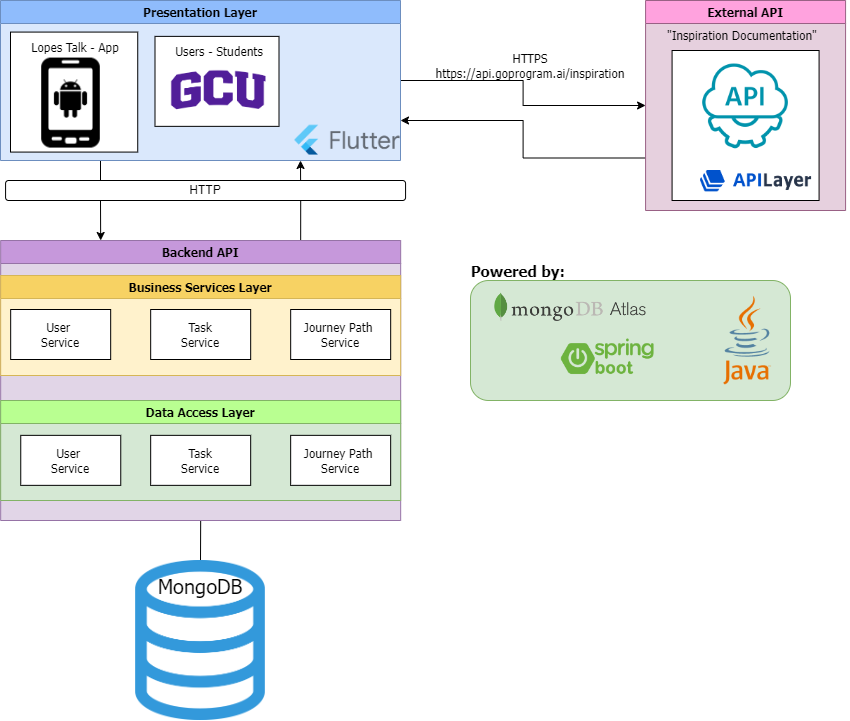
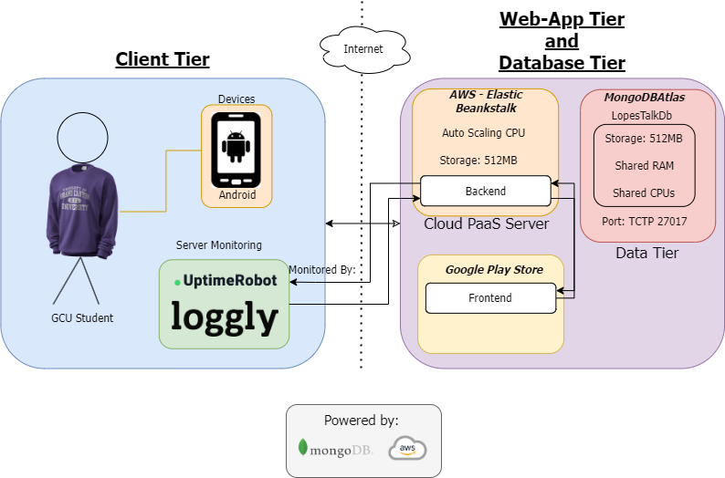
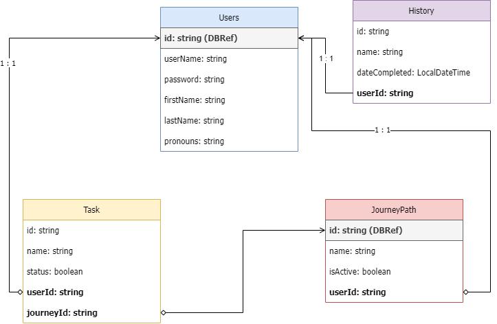
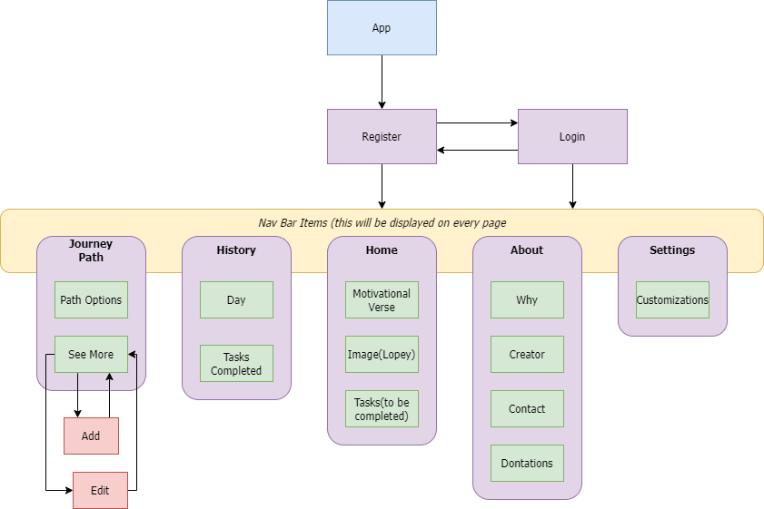
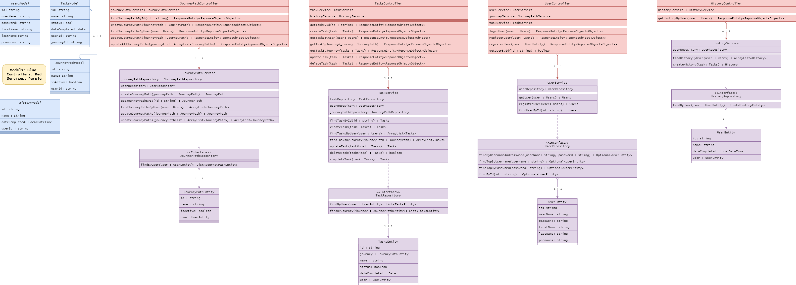

<table>
  <tr>
    <td>  </td>
    <td>  </td>
    <td>  </td>
    <td>  </td>
    <td>  </td>
    <td>  </td>
    <td>  </td>
    <td>  </td>
    <td>  </td>
    <td>  </td>
  </tr>

  <tr>
    <td colspan=3></td>
    <td colspan=4 align="center"><h1>LopesTalk Project Portfolio</h1></td>
    <td colspan=3></td>
  </tr>
  <tr>
    <td colspan=10 align="center"><h3>Jesseña Quiñones</h3></td>
  </tr>
    <tr>
    <td>  </td>
    <td>  </td>
    <td>  </td>
    <td>  </td>
    <td>  </td>
    <td>  </td>
    <td>  </td>
    <td>  </td>
    <td>  </td>
    <td>  </td>
  </tr>
</table>

<h2>Table of Contents</h2>

<ul>
  <li><a href="#introduction">Introduction</a></li>
  <li><a href="#requirements">Requirements</a>
    <ul>
      <li><a href="#functional-requirements">Functional Requirements</a></li>
      <li><a href="#non-functional-requirements-nfrs">Non-Functional Requirements (NFRs)</a></li>
    </ul>
  </li>
  <li><a href="#technologies--tools">Technologies &amp; Tools</a></li>
  <li><a href="#cloud-deployment">Cloud Deployment</a>
    <ul>
      <li><a href="#frontend-flutter-app">Frontend (Flutter App)</a></li>
      <li><a href="#backend-spring-boot">Backend (Spring Boot)</a></li>
      <li><a href="#cross-origin-resource-sharing-cors">Cross-Origin Resource Sharing (CORS)</a></li>
      <li><a href="#monitoring">Monitoring</a></li>
    </ul>
  </li>
  <li><a href="#technical-approach">Technical Approach</a></li>
  <li><a href="#risks--challenges">Risks &amp; Challenges</a></li>
  <li><a href="#demonstrations">Demonstrations</a></li>
  <li><a href="#contacts">Contacts</a></li>
</ul>

<h4 id="introduction">Introduction</h4>

LopesTalk is a mental health app designed to empower students to prioritize their well-being through fun and engaging self-care activities. Our mission is to help students succeed in their academic and personal goals by focusing on self-care, one task at a time. As Lopers, we are passionate about making a positive impact in the GCU community and beyond, and we believe that by taking care of ourselves, we can better support and care for those around us. With our innovative approach and commitment to mental health, LopesTalk is here to help students thrive.

<h2 id="requirements">Requirements</h2>

<h3 id="functional-requirements">Functional Requirements</h3>

<ul>
  <li>Users can sign up for an account</li>
  <li>Users can log into their account</li>
  <li>Users can access a variety of self-care paths and tasks</li>
  <li>Users will be able to see the LopesTalk mascot 'Lopey' on home screen</li>
  <li>Users can see a daily motivaitonal quote with author</li>
  <li>Users can add/delete/update tasks for journey paths</li>
</ul>

<h3 id="non-functional-requirements-nfrs">Non-Functional Requirements (NFRs)</h3>

<ul>
  <li>The app should be responsive and connected 80% during the month</li>
  <li>The app should be responsive and work well on different Android devices: (mobile, tablet)</li>
  <li>The app should be fast and responsive, with minimal lag or delay</li>
</ul>

<h2 id="technologies--tools">Technologies &amp; Tools</h2>

LopesTalk is built using the following technologies and tools:

<ul>
  <li>Flutter [v3.7.10]</li>
  <li>Dart [2.19.6]</li>
  <li>Spring Boot [3.0.5]
    <ul>
      <li>MongoDB.Driver [v2.15.0]</li>
      <li>Java [v17.0]</li>
    </ul>
  <li>MongoDB Atlas</li>
  <li>Hosting
      <ul>
      <li>AWS Hosting Elastic Beanstalk Service</li>
    </ul>
  <li>Other Tools
    <ul>
      <li>Postman \[v10.12.13]</li>
      <li>Swagger \[3.0]</li>
      <li>UpTimeRobot Monitoring</li>
      <li>VSCode IDE \[v1.77.3]</li>
    </ul>

<table>
  <tr align="center">
    <td>
      
    </td>
    <td>
      
    </td>
    <td>
      
   </td>
  </tr><tr></tr>
  <tr align="center">
    <td align="center">
      
    </td>
    <td>
      
    </td>
    <td>
      
    </td>
</table>

<h2>Cloud Deployment</h2>

LopesTalk is deployed on the cloud using the following services:

<h3>Frontend (Flutter App)</h3>

The Flutter app is deployed through the Google Play Store.

<h3>Backend (Spring Boot)</h3>

The custom API is deployed on AWS Elastic Beanstalk, a cloud platform as a service (PaaS) that allows us to easily deploy and scale web applications.

<h3>Cross-Origin Resource Sharing (CORS)</h3>

To allow cross-origin requests from the Flutter app to the API

<h3>Monitoring</h3>

LopesTalk uses UptimeRobot to monitor errors and exceptions that occur in the app.

<h2>Technical Approach</h2>

Our application follows a client-server architecture, with the Flutter framework serving as the client and Spring Boot serving as the server. The client-server architecture allows for a clear separation of concerns between the user interface and the application logic.

In terms of development methodology, we have opted for a waterfall approach. This approach emphasizes a linear, sequential process where each stage of the development process (requirements, design, implementation, testing, and deployment) is completed before moving on to the next stage. While this approach may not be as flexible as Agile, it allows for well-defined requirements and a fixed scope.

We are also following a modular design pattern, which allows us to break down the application into smaller, reusable components. This makes it easier to maintain and update the codebase over time.

Finally, we are using MongoDB Atlas as our database. This cloud-based database service provides us with a scalable, secure, and reliable database solution for our application.

<table>
  <tr>
    <td>
      <figure>
        
        <figcaption>Figure 1: Logical Architecture Diagram</figcaption>
      </figure>
    </td>
    <td>
      <figure>
        
        <figcaption>Figure 2: Physical Solution Diagram</figcaption>
      </figure>
    </td>
    <td>
      <figure>
        
        <figcaption>Figure 3: Schema Diagram</figcaption>
      </figure>
    </td>
  </tr>
  <tr>
    <td>
       <figure>
        
        <figcaption>Figure 4: Sitemap Diagram</figcaption>
      </figure>
    </td>
    <td>
      <<figure>
        
        <figcaption>Figure 5: UML Diagram</figcaption>
      </figure>
    </td>
    <td></td>
  </tr>
</table>

<h2>Risks & Challenges</h2>

A few challenges when writing the app was the following:

<ul>
  <li>Investing in a cloud server- AWS</li>
  <li>Hosting on a cloud server</li>
  <li>Monitoring app uptime</li>
  <li>Learning a new open source software platform - Flutter</li>
  <li>Investing into graphic design(paying artist)</li>
  <li>Investing to be able to publish on the Google Play Store</li>
  <li>Implementing an external API for Quotes</li>
</ul>

A few risks when writing the app was the following:

<ul>
  <li>Before I could get LopesTalk up and running one risk was the idea of using Flutter. If it wasn't a good fit I was going to need to switch to another application such as Android Studio.</li>
  <li>One risk of building LopesTalk was the the mascot. I wanted to give the users a virtual friend but drawing wise I struggle. I was able to buy some art from a friend to give users Lopey!</li>
  <li>Another risk was the idea of implementing an external API. This would save me time instead of having to fully create an API by scratch for motivational quotes.</li>
</ul>

One of the main challenges in developing LopesTalk is creating engaging and effective self-care resources that resonate with students. To tackle this, I researched various self-care routes and gathered relevant examples. Providing users with a clear understanding of each path with tasks.

<h2>Demonstrations</h2>

<a href="https://www.loom.com/share/f4eee4d4013f48d48293ff7592d6984f">Final Project Completion and Presentation

<a href="https://www.loom.com/share/1ff1b925fbca4d1a8cc01d0f8edce9d6">LopesTalk Benchmark

<h2>Contacts</h2>

<ul>
  <li>Jesseña Quiñones - <a href="https://www.linkedin.com/in/jessena-quinones">LinkedIn</a> - <a href="https://github.com/jessenaqu">GitHub</a>

